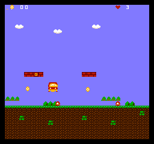

# NEScript

A statically-typed, compiled programming language for NES game development.

NEScript compiles `.ne` source files directly into playable iNES ROM files, with no external assembler or linker dependencies. The compiler handles everything from source text to a ROM you can run in any NES emulator.



_Source: [`examples/platformer.ne`](examples/platformer.ne)_

## Quick Start

```bash
# Build the compiler
cargo build --release

# Compile an example
cargo run -- build examples/hello_sprite.ne

# Run the output ROM in an emulator
# (produces examples/hello_sprite.nes)
```

## Hello World

```
game "Hello" {
    mapper: NROM
}

var px: u8 = 128
var py: u8 = 120

on frame {
    if button.right { px += 2 }
    if button.left  { px -= 2 }
    if button.down  { py += 2 }
    if button.up    { py -= 2 }

    draw Smiley at: (px, py)
}

start Main
```

## Features

- **Game-aware syntax** -- states, sprites, palettes, backgrounds, and input are first-class constructs
- **Full type system** -- `u8`, `i8`, `u16`, `bool`, fixed-size arrays (`u8[N]`), `enum`, `struct`
- **Rich control flow** -- `if`/`else`, `while`, `for i in 0..N`, `loop`, `match`
- **Functions** -- with parameters, return types, `inline` hint, recursion detection
- **State machines** -- `state` with `on enter`, `on exit`, `on frame`, `on scanline(N)` handlers
- **Compile-time safety** -- call depth limits, recursion detection, type checking, unused-var warnings
- **IR-based optimizer** -- constant folding, dead code elimination, strength reduction (incl. div/mod by power-of-two), copy propagation, peephole passes including INC/DEC fold and live-range slot recycling
- **Full 16-bit arithmetic** -- u16 add/sub/compare lower to carry-propagating paired operations
- **Multiple mappers** -- NROM, MMC1, UxROM, MMC3 (including multi-scanline IRQ dispatch per state)
- **Audio subsystem** -- frame-walking pulse driver with user-declared `sfx`/`music` blocks, builtin effects and tracks, period table, and zero-cost elision when unused
- **Palette & background pipeline** -- `palette` and `background` blocks, initial values loaded at reset, vblank-safe `set_palette` / `load_background` runtime swaps
- **Asset pipeline** -- PNG-to-CHR conversion, inline tile data, sfx envelopes, music note streams
- **Inline assembly** -- `asm { ... }` with `{var}` substitution, plus `raw asm { ... }` for verbatim blocks
- **Hardware intrinsics** -- `poke(addr, value)` / `peek(addr)` for direct register access
- **Debug support** -- `--debug` flag enables `debug.log` / `debug.assert` writes to the emulator debug port
- **Compile-time diagnostics** -- `--dump-ir`, `--memory-map`, `--call-graph` flags
- **Single binary** -- no dependencies on ca65, Python, or any external tools

## Documentation

- **[Language Guide](docs/language-guide.md)** -- complete reference for every language feature
- **[Architecture](docs/architecture.md)** -- compiler internals and module overview
- **[NES Reference](docs/nes-reference.md)** -- hardware quick reference for contributors
- **[Examples README](examples/README.md)** -- how to build and run examples

## Examples

| Example | Features demonstrated |
|---------|---------------------|
| [`hello_sprite.ne`](examples/hello_sprite.ne) | D-pad input, sprite drawing |
| [`bouncing_ball.ne`](examples/bouncing_ball.ne) | Automatic movement, edge detection |
| [`coin_cavern.ne`](examples/coin_cavern.ne) | Multi-state game, functions, constants, gravity |
| [`arrays_and_functions.ne`](examples/arrays_and_functions.ne) | Arrays, functions, while loops, inline functions |
| [`state_machine.ne`](examples/state_machine.ne) | State transitions, on enter/exit, timers |
| [`sprites_and_palettes.ne`](examples/sprites_and_palettes.ne) | Inline CHR data, scroll, type casting |
| [`mmc1_banked.ne`](examples/mmc1_banked.ne) | MMC1 mapper, bank declarations, multiply |
| [`uxrom_user_banked.ne`](examples/uxrom_user_banked.ne) | UxROM mapper with a `bank Foo { fun ... }` block — first example to put real user code in a switchable bank, called via a generated cross-bank trampoline |
| [`uxrom_banked_to_banked.ne`](examples/uxrom_banked_to_banked.ne) | UxROM with two `bank Foo { fun ... }` blocks — exercises a banked→banked call (`step` in `Logic` calls `clamp` in `Helpers`) routed through the same trampoline that handles fixed→banked |
| [`palette_and_background.ne`](examples/palette_and_background.ne) | Palette and background declarations, reset-time load, vblank-safe `set_palette` / `load_background` swaps |
| [`friendly_assets.ne`](examples/friendly_assets.ne) | **Pleasant asset syntax** — named NES colours, grouped `bg0..sp3` palettes with `universal:`, ASCII pixel-art sprites, `legend { } + map:` tilemaps, `palette_map:` attribute grids, scalar sfx `pitch:`, note-name music with `tempo:` |
| [`structs_enums_for.ne`](examples/structs_enums_for.ne) | Structs, enums, `for` loops, struct literals |
| [`nested_structs.ne`](examples/nested_structs.ne) | Nested-struct fields (`hero.pos.x`) and array struct fields (`hero.inv[0]`) with chained literal initializers |
| [`inline_asm_demo.ne`](examples/inline_asm_demo.ne) | Inline asm with `{var}` substitution, `poke`/`peek` |
| [`audio_demo.ne`](examples/audio_demo.ne) | Audio subsystem: user `sfx`/`music` blocks, builtin effects, `play`/`start_music`/`stop_music` |
| [`noise_triangle_sfx.ne`](examples/noise_triangle_sfx.ne) | Noise and triangle channel sfx via `channel: noise` / `channel: triangle` on `sfx` blocks |
| [`platformer.ne`](examples/platformer.ne) | **End-to-end side-scroller** — custom CHR tileset, full background nametable, metasprite player with gravity/jump physics, wrap-around scrolling, stomp-or-die enemy collisions, live stomp-count HUD, pickup coins, user-declared SFX + music, and a Title → Playing → GameOver state machine with a proximity-based autopilot so the headless harness demonstrates the full gameplay loop (stomp, stomp, die, retry) inside six seconds |

## Compiler Commands

```bash
# Compile to ROM
nescript build game.ne

# Compile with custom output path
nescript build game.ne --output my_game.nes

# Type-check only (no ROM output)
nescript check game.ne

# View generated 6502 assembly
nescript build game.ne --asm-dump

# Enable debug mode
nescript build game.ne --debug
```

## Emulator Compatibility

Output ROMs are standard iNES format and work with any NES emulator:

- **[Mesen](https://www.mesen.ca/)** -- recommended, best debugging support
- **[FCEUX](https://fceux.com/)**
- **[Nestopia](http://nestopia.sourceforge.net/)**

## Project Status

NEScript implements all five planned milestones:

| Milestone | Status | Key Features |
|-----------|--------|-------------|
| M1: Hello Sprite | Done | Full compiler pipeline, assembler, ROM builder |
| M2: Game Loop | Done | Functions, arrays, IR, optimizer, call graph analysis |
| M3: Asset Pipeline | Done | PNG-to-CHR, sprites, `debug.log` / `debug.assert` |
| M4: Optimization | Done | Strength reduction, ZP promotion, type casting, asm-dump |
| M5: Bank Switching | Done | MMC1/UxROM/MMC3, bank declarations, software mul/div |

497 tests across the lexer, parser, analyzer, IR, optimizer, codegen, assembler, linker, runtime, ROM, and asset modules, with CI running fmt, clippy, test, and example compilation on every push.

## License

[MIT](LICENSE)
