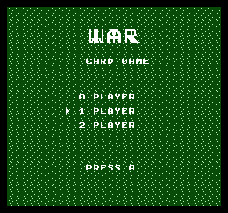
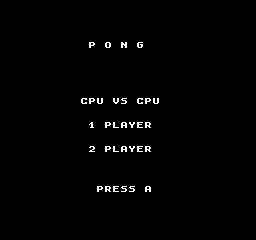

# NEScript

A statically-typed, compiled programming language for NES game development.

NEScript compiles `.ne` source files directly into playable iNES ROM files, with no external assembler or linker dependencies. The compiler handles everything from source text to a ROM you can run in any NES emulator.


_Source: [`examples/platformer.ne`](examples/platformer.ne)_



_Source: [`examples/war.ne`](examples/war.ne)_



_Source: [`examples/pong.ne`](examples/pong.ne)_

## Quick Start

```bash
# Build the compiler
cargo build --release

# Compile an example
cargo run -- build examples/hello_sprite.ne

# Run the output ROM in an emulator
# (produces examples/hello_sprite.nes)
```

## Hello World

```
game "Hello" {
    mapper: NROM
}

var px: u8 = 128
var py: u8 = 120

on frame {
    if button.right { px += 2 }
    if button.left  { px -= 2 }
    if button.down  { py += 2 }
    if button.up    { py -= 2 }

    draw Smiley at: (px, py)
}

start Main
```

## Features

- **Game-aware syntax** -- states, sprites, palettes, backgrounds, and input are first-class constructs
- **Full type system** -- `u8`, `i8`, `u16`, `bool`, fixed-size arrays (`u8[N]`), `enum`, `struct`
- **Rich control flow** -- `if`/`else`, `while`, `for i in 0..N`, `loop`, `match`
- **Functions** -- with parameters, return types, real `inline fun` splicing for single-return and void-body shapes, recursion detection
- **State machines** -- `state` with `on enter`, `on exit`, `on frame`, `on scanline(N)` handlers
- **Compile-time safety** -- call depth limits, recursion detection, type checking, unused-var warnings
- **IR-based optimizer** -- constant folding, dead code elimination, strength reduction (incl. div/mod by power-of-two), copy propagation, peephole passes including INC/DEC fold and live-range slot recycling
- **Full 16-bit arithmetic** -- `u16` and `i16` add/sub/compare lower to carry-propagating paired operations; negative `i16` literals fold to wide two's complement
- **Battery-backed saves** -- `save { var ... }` blocks land at `$6000+`, flip the iNES battery flag, and persist across power cycles
- **VRAM update buffer** -- `nt_set(x, y, tile)`, `nt_attr(x, y, val)`, `nt_fill_h(x, y, len, tile)` queue PPU writes during `on frame`; the NMI drains them at vblank without touching `$2006`/`$2007` from user code
- **Multiple mappers** -- NROM, MMC1, UxROM, MMC3 (including multi-scanline IRQ dispatch per state), AxROM (mapper 7), CNROM (mapper 3), GNROM / MHROM (mapper 66)
- **Runtime PRNG** -- `rand8()`, `rand16()`, `seed_rand(s)` backed by a zero-cost-when-unused Galois LFSR
- **Edge-triggered input** -- `p1.button.a.pressed` / `.released` for menu / one-shot input handling
- **Palette brightness fades** -- `set_palette_brightness(level)` + blocking `fade_out(n)` / `fade_in(n)` helpers
- **Sprite-0 split** -- `sprite_0_split(scroll_x, scroll_y)` for mid-frame scroll changes on any mapper
- **Auto sprite cycling** -- `game { sprite_flicker: true }` to mitigate the NES's 8-sprites-per-scanline limit with no per-frame boilerplate
- **Configurable debug port** -- `game { debug_port: fceux \| mesen \| 0xXXXX }` targets either debugger convention
- **Audio subsystem** -- frame-walking pulse driver with user-declared `sfx`/`music` blocks, builtin effects and tracks, period table, and zero-cost elision when unused
- **Palette & background pipeline** -- `palette` and `background` blocks, initial values loaded at reset, vblank-safe `set_palette` / `load_background` runtime swaps
- **Asset pipeline** -- PNG-to-CHR conversion, inline tile data, sfx envelopes, music note streams
- **Inline assembly** -- `asm { ... }` with `{var}` substitution, plus `raw asm { ... }` for verbatim blocks
- **Hardware intrinsics** -- `poke(addr, value)` / `peek(addr)` for direct register access
- **Debug support** -- `--debug` flag enables `debug.log` / `debug.assert`, runtime array bounds checks, frame-overrun and sprite-overflow counters, and the `debug.frame_overrun_count()` / `debug.frame_overran()` / `debug.sprite_overflow_count()` / `debug.sprite_overflow()` query builtins — all stripped entirely in release builds
- **Sprite-per-scanline mitigations** -- three layers of defense for the NES's 8-sprites-per-scanline hardware limit: compile-time `W0109` static check for literal layouts, runtime `cycle_sprites` flicker intrinsic for dynamic scenes, and debug-mode telemetry via `debug.sprite_overflow()` for playtest assertions
- **Compile-time diagnostics** -- `--dump-ir`, `--memory-map`, `--call-graph` flags
- **Single binary** -- no dependencies on ca65, Python, or any external tools

## Documentation

- **[Language Guide](docs/language-guide.md)** -- complete reference for every language feature
- **[Architecture](docs/architecture.md)** -- compiler internals and module overview
- **[NES Reference](docs/nes-reference.md)** -- hardware quick reference for contributors
- **[Examples README](examples/README.md)** -- how to build and run examples

## Examples

| Example | Features demonstrated |
|---------|---------------------|
| [`hello_sprite.ne`](examples/hello_sprite.ne) | D-pad input, sprite drawing |
| [`bouncing_ball.ne`](examples/bouncing_ball.ne) | Automatic movement, edge detection |
| [`coin_cavern.ne`](examples/coin_cavern.ne) | Multi-state game, functions, constants, gravity |
| [`arrays_and_functions.ne`](examples/arrays_and_functions.ne) | Arrays, functions, while loops, inline functions |
| [`state_machine.ne`](examples/state_machine.ne) | State transitions, on enter/exit, timers |
| [`sprites_and_palettes.ne`](examples/sprites_and_palettes.ne) | Inline CHR data, scroll, type casting |
| [`mmc1_banked.ne`](examples/mmc1_banked.ne) | MMC1 mapper, bank declarations, multiply |
| [`uxrom_user_banked.ne`](examples/uxrom_user_banked.ne) | UxROM mapper with a `bank Foo { fun ... }` block — first example to put real user code in a switchable bank, called via a generated cross-bank trampoline |
| [`uxrom_banked_to_banked.ne`](examples/uxrom_banked_to_banked.ne) | UxROM with two `bank Foo { fun ... }` blocks — exercises a banked→banked call (`step` in `Logic` calls `clamp` in `Helpers`) routed through the same trampoline that handles fixed→banked |
| [`palette_and_background.ne`](examples/palette_and_background.ne) | Palette and background declarations, reset-time load, vblank-safe `set_palette` / `load_background` swaps |
| [`auto_chr_background.ne`](examples/auto_chr_background.ne) | `background Stage @nametable("file.png")` with **automatic CHR generation** — the resolver dedupes the PNG's 8×8 cells, encodes them as 2-bitplane CHR, and slots them into CHR ROM after the sprite tile range |
| [`friendly_assets.ne`](examples/friendly_assets.ne) | **Pleasant asset syntax** — named NES colours, grouped `bg0..sp3` palettes with `universal:`, ASCII pixel-art sprites, `legend { } + map:` tilemaps, `palette_map:` attribute grids, scalar sfx `pitch:`, note-name music with `tempo:` |
| [`structs_enums_for.ne`](examples/structs_enums_for.ne) | Structs, enums, `for` loops, struct literals |
| [`nested_structs.ne`](examples/nested_structs.ne) | Nested-struct fields (`hero.pos.x`) and array struct fields (`hero.inv[0]`) with chained literal initializers |
| [`inline_asm_demo.ne`](examples/inline_asm_demo.ne) | Inline asm with `{var}` substitution, `poke`/`peek` |
| [`audio_demo.ne`](examples/audio_demo.ne) | Audio subsystem: user `sfx`/`music` blocks, builtin effects, `play`/`start_music`/`stop_music` |
| [`noise_triangle_sfx.ne`](examples/noise_triangle_sfx.ne) | Noise and triangle channel sfx via `channel: noise` / `channel: triangle` on `sfx` blocks |
| [`sfx_pitch_envelope.ne`](examples/sfx_pitch_envelope.ne) | Per-frame pulse `pitch:` arrays — the audio tick walks the pitch envelope in lockstep with the volume envelope and writes `$4002` on every NMI for a frequency-sweeping siren tone |
| [`metasprite_demo.ne`](examples/metasprite_demo.ne) | `metasprite Hero { sprite: ..., dx: [...], dy: [...], frame: [...] }` declarative multi-tile groups — `draw Hero at: (x, y)` expands to one OAM slot per tile so 16×16 sprites stop needing four hand-written `draw` statements |
| [`sprite_flicker_demo.ne`](examples/sprite_flicker_demo.ne) | `cycle_sprites` — rotates the OAM DMA start offset one slot per frame so scenes with more than 8 sprites on a scanline drop a *different* one each frame. Turns the NES's permanent sprite-dropout hardware symptom into visible flicker, which the eye reconstructs from adjacent frames. Pairs with the compile-time `W0109` warning and the debug-mode `debug.sprite_overflow()` / `debug.sprite_overflow_count()` telemetry for a three-layer defense against the 8-sprites-per-scanline limit. |
| [`platformer.ne`](examples/platformer.ne) | **End-to-end side-scroller** — custom CHR tileset, full background nametable, metasprite player with gravity/jump physics, wrap-around scrolling, stomp-or-die enemy collisions, a sprite-based status bar pinned above the scrolling playfield (coin icon + 2-digit score on the left, heart icon + lives counter on the right) that carries through into the death screen, cross-state life tracking that cycles GameOver → Playing while hearts last and back to Title when the last heart is spent, pickup coins, user-declared SFX + music, and a Title → Playing → GameOver state machine with a proximity-based autopilot so the headless harness demonstrates the full gameplay loop (stomp, stomp, die, retry) inside six seconds |
| [`war.ne`](examples/war.ne) | **Production-quality card game** — a complete port of War split across `examples/war/*.ne`: title screen with a 0/1/2-player menu, animated deal, sliding face-up cards, deck-count HUD, "WAR!" tie-break with buried cards, victory screen with a fanfare, and a brisk 4/4 march on pulse 2. Pulls in nearly every NEScript subsystem (custom 88-tile sheet, felt nametable, 8-bit LFSR PRNG, queue-based decks, phase machine inside `Playing`, multiple sfx + music tracks). Building it surfaced seven compiler bugs, all fixed on the same branch — see `git log` for the details. |
| [`feature_canary.ne`](examples/feature_canary.ne) | **Regression canary** — a minimal program that paints a green universal backdrop at frame 180 when every memory-affecting construct round-trips correctly, and flips to red if any check fails. The committed golden is green; any silent-drop regression (state-locals, uninit struct field writes, u16 high byte, array elements, `slow` placement, function return values) turns it red. Built after PR #31 to close the "goldens capture whatever happens, not what should happen" failure mode that let the state-local bug survive for a year. |
| [`sha256.ne`](examples/sha256.ne) | **Interactive SHA-256 hasher** — an on-screen keyboard lets the player type up to 16 ASCII characters, and pressing ↵ runs a full FIPS 180-4 SHA-256 compression on the NES (64 rounds + 48-entry message-schedule expansion, all written in NEScript with inline-asm 32-bit primitives). The 64-character hex digest renders as sprites across eight 8-character rows at the bottom of the screen. Splits across `examples/sha256/*.ne` with a phased driver that runs four iterations per frame so the full hash finishes in well under a second; the jsnes golden captures `SHA-256("NES")` = `AE9145DB5CABC41FE34B54E34AF8881F462362EA20FD8F861B26532FFBB84E0D`. |

## Compiler Commands

```bash
# Compile to ROM
nescript build game.ne

# Compile with custom output path
nescript build game.ne --output my_game.nes

# Type-check only (no ROM output)
nescript check game.ne

# View generated 6502 assembly
nescript build game.ne --asm-dump

# Enable debug mode
nescript build game.ne --debug
```

## Emulator Compatibility

Output ROMs are standard iNES format and work with any NES emulator:

- **[Mesen](https://www.mesen.ca/)** -- recommended, best debugging support
- **[FCEUX](https://fceux.com/)**
- **[Nestopia](http://nestopia.sourceforge.net/)**

## Project Status

NEScript implements all five planned milestones:

| Milestone | Status | Key Features |
|-----------|--------|-------------|
| M1: Hello Sprite | Done | Full compiler pipeline, assembler, ROM builder |
| M2: Game Loop | Done | Functions, arrays, IR, optimizer, call graph analysis |
| M3: Asset Pipeline | Done | PNG-to-CHR, sprites, `debug.log` / `debug.assert` |
| M4: Optimization | Done | Strength reduction, ZP promotion, type casting, asm-dump |
| M5: Bank Switching | Done | MMC1/UxROM/MMC3, bank declarations, software mul/div |

694 tests across the lexer, parser, analyzer, IR, optimizer, codegen, assembler, linker, runtime, ROM, and asset modules, plus a pixel- and audio-exact emulator harness that captures a golden framebuffer + audio hash for every example. CI runs fmt, clippy, test, example compilation, and the emulator harness on every push.

## License

[MIT](LICENSE)
